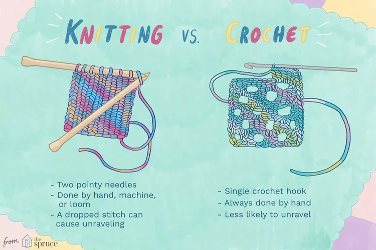
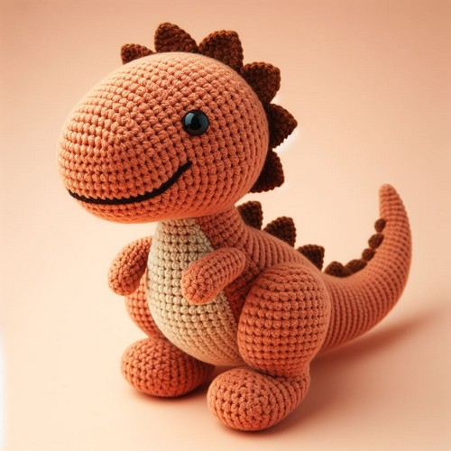

# 1
## Simulation
- allow open ended plushies
- flooring modes
- error-resistancy
- compile flag for strict but expensive assertions (sanity macro)
- growing one by one stitch

## Patterns
- starting from chains
- marks and gotos
- round repeats

## Evolution
- plushie fitness
- plushie visual comparison
- evolution experiments
- idiot-proof parsing (obligatory for genetic algorithms)

##
- infrastruktura pod eksperymenty genetyczne
  - konwersja: STL -> jednorodna chmura punktowa (.json)
  - generowanie osobnikow, operacje genetyczne
  - ocena populacji przez HTTP request do symulatora
  - funkcja fitnesu
    - dla kazdego punktu w wygenerowanym pluszaku znajdz najblizszy punkt w chmurze punktowej, suma odleglosci to fitness
    - używam [R-tree](https://en.wikipedia.org/wiki/R-tree) dla szukania w czasie O(log n)
    - kwadrat zeby bardziej karac
    - normalizacja dla zatrzymywania

- cargo run ws --preset pillar
- npm run dev

- same eksperymenty jeszcze nie wychodza
  - zatrzymywanie symulacji w odpowiednim momencie
    - elbow method?
  - obrót przy użyciu BLO/FLO
    - refactor szkieletu (generalized cyllinder)
      - [Skeleton Extraction from 3D Point Clouds by Decomposing the Object into Parts](https://arxiv.org/pdf/1912.11932.pdf)
  - wydajność
    - multithreading?
    - gpu?
    - cloud?
    - modyfikacja podczas symulacji?
    - zamiast przesuniecia, relatywne przesuniecie wzgledem innych
  - naiwna mutacja

- terminy
  - deklaracji w usos
    - 13.09 (w naszym wypadku)
  - kiedy sa składane i bronione prace
    - skladanie +- tydzien przed obrona
    - na magisterskie => przed rekrutacja na magisterke (styczen)
    -

- praca ok. 40 stron
  - sa konwertery markdown na latex
  - strukture
    - wstep - motywacja
    - opis algorytmow (teoria)(tylko to co potrzebne do zrozumienia implementacji)
    - projekt implementacji
    - wyniki
    - podsumowanie realizacji celow

## task
- elbow detection
- eksperymenty czy faktycznie obrot przeszkadza
- promotor jest ok z pojsciem w narzedzie jak to nie wyjdzie

## wynik
graf napiecia jest nieprzewidywalny

relaks ~ 0.002

relaks ~ 0.5

kolanko odpada, mozna trackowac zmiane w czasie, jesli jest mała to uznajemy że zakończono relaksowanie

podzielenie napiecia przez liczbe punktow utrudnia sprawe przy malych ksztaltach, bo wartosci sa za male

nadal pozostaje problem wybrania progow