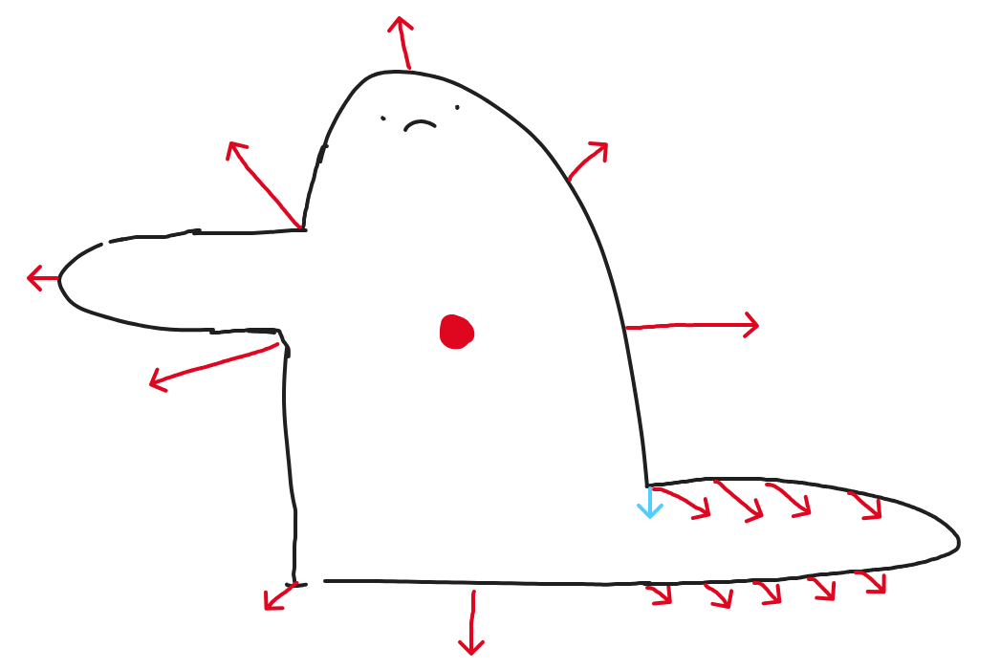
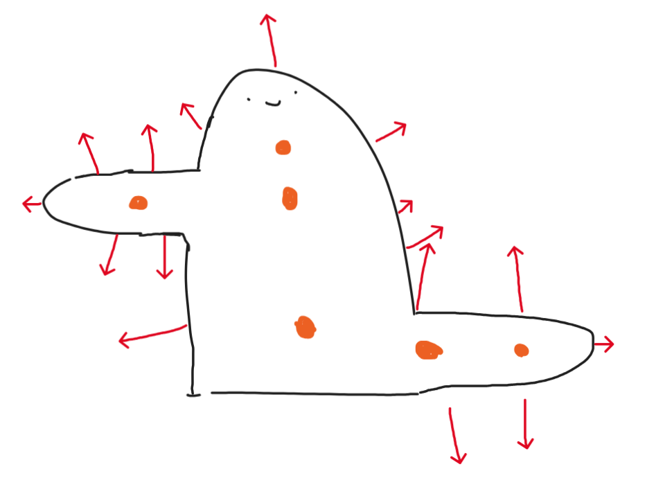
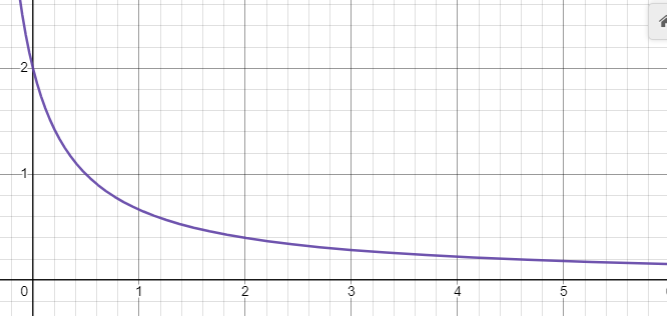
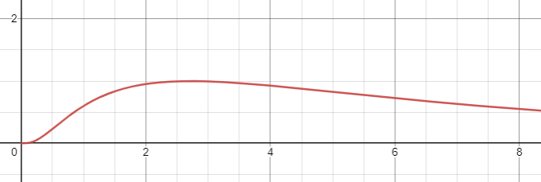
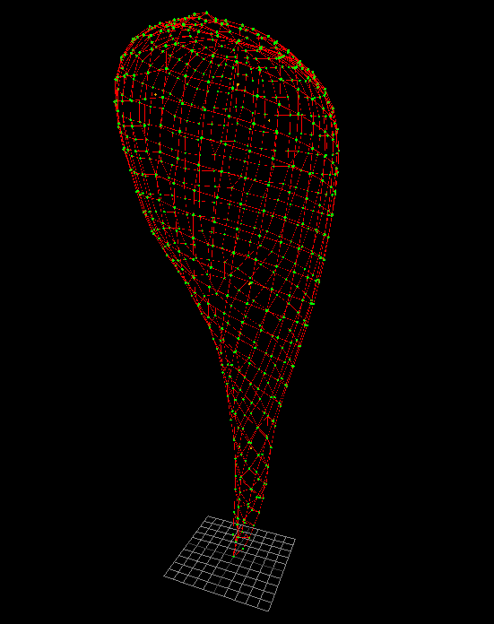
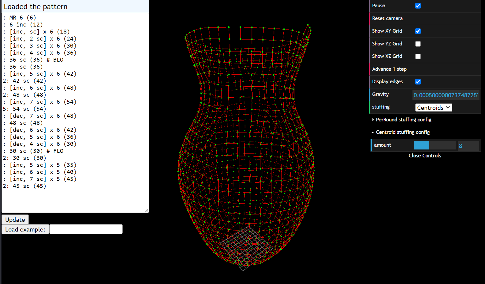

# Requirements

Code name for the visualized entity is `Plushie`.

Plushie must support
- writing to STL
- inserting / removing / changing stitches and adapting to the changes
  - `Pattern` and `Pattern -> Plushie` conversion must be defined first
- variable pressure (stuffing amount)
- fixed points (one is the bare minimum)

# Implementation

Location of vertices is calculated with a variation of a [force-directed graph](https://en.wikipedia.org/wiki/Force-directed_graph_drawing).

## Attraction / repulsion
Connections (edges) between stitches (nodes) are the most basic source of tension in a `Plushie`. Each two connected nodes will attract on each other with force along the axis going through them, with magnitude given by
$$f(x)=\frac{(x-d)^{3}}{(\frac{x}{2}+d)^{3}}\{x\ge0\}$$
where
- x: distance between nodes
- d: desired distance between nodes
- positive $f(x)$ means attraction, negative means repulsion

*attraction function for d=1*

## Stuffing

### Omnidirectional stuffing
Calculating center of mass, then pushing away from it would be trivial, however it would fail for certain concave shapes, as well as shapes with limbs.

What we actually need is a [skeleton](https://scikit-image.org/docs/stable/auto_examples/edges/plot_skeleton.html) that will repel walls

The pushing part could be simplified by sampling points along the skeleton

Problem: the plushie is a point cloud, a radically different data structure than 2D images for which skeletonization is defined

[The algorithm is also utilized in 3D](https://imagej.net/plugins/skeletonize3d)

- Skeletonization needs a volumetric representation (3D binary image)
- how do I convert a point cloud of a plushie into binary image
  - by analogy to 2D images
    - filling holes morphology
  - by dilation from XZ axis
    - requirement: the cloud is around the axis
    - problem: how to handle shapes going through the axis at some point (imagine crochetting a standing letter `C`)
      - could be handled by starting the dilation at origin
      - or before the actual dilation
        - dilute along XZ axis
          - by "dilute" I mean mark voxels as `inside` as long as there is no wall in vicinity
        - if encountered a wall, continue processing, but don't mark voxels
        - when a wall is encountered again start marking once again
        - repeat

### Skeleton stuffing

#### Recap
Genom -> Pattern -> Plushie(initial) -> Plushie(relaxed) -> Shape -> fitness

Genom -> Pattern
- creates rounds from stitch list
- ensures the ending circle won't glitch a Plushie

Pattern -> Plushie(initial)
- turns rounds into a list of Points
- could essentially work on a 1D list
- prepares positions for relaxing

Plushie(initial) -> Plushie(relaxed)
- moves the point cloud around, until there is no stress

Plushie(relaxed) -> Shape
- prepares the point cloud for comparison

Now we must add a skeleton to the process.
*Bone* = a point that lies on the skeleton. Bone count can be calculated based on overall volume, and density parametrized

#### Morphology/volumetric approach
- Pushie initialization
  - the initial placement of points shall be improved (take round size into account)
  - after the initial placement, an initial skeleton is calculated
    - prepare a 3D image, init with 0's
    - find the insides of a plushie
      - TODO
      - clone this result, add voxels containing walls, make it available for volumetric fitness function
    - skeletonize the image
      - morphology
        - TODO
- Plushie relaxation
  - calculate displacement
    - perform link attraction
    - stuffing: for each point
      - option 1
        - find the nearest bone
        - save that point belongs to that bone in a map
        - push the point away from the bone
      - option 2
        - push the point from each bone
        - seems like the more accurate way
  - apply displacement
    - apply displacement
    - update the volumetric state where points change voxels
      - assumption: point can only transfer to neighboring voxels in one step OR additional logic that handles those jumps
    - update bone positions based on total voxel movement of it's points
- Since volumetric representation is already calculated, it could be used for a fitness function

#### Point cloud clustering approach
- Pushie initialization
  - the initial placement of points shall be improved (take round size into account)
  - after the initial placement calculate initial skeleton
    - k-means and it's centroids?
    - that would directly give bones, but can accuracy be guaranteed?
    - it's not obvious for me which approach is more efficient
    - this approach does not require volumetric representation
    - approach needs some testing on 2D images
- Plushie relaxation
  - calculate displacement
    - perform link attraction
    - stuffing: for each point
      - option 1
        - find the nearest bone
        - save that point belongs to that bone in a map
        - push the point away from the bone
      - option 2
        - push the point from each bone
        - seems like the more accurate way
  - apply displacement
    - apply displacement
    - update the volumetric state where points change voxels
      - assumption: point can only transfer to neighboring voxels in one step OR additional logic that handles those jumps
    - update bone positions based on total voxel movement of it's points
- There is no volumetric representation involved, so fitness must work on point clouds here

*the same ball using early version of kmeans based approach. Effect is stable in time, even with gravity. The spiral building a plushie is clearly visible, which is a great improvement.*

Initial tests show that point cloud based vertical stuffing is approximately 2 times slower

### Centroid stuffing
Algorithm inspired by k-means

- on creation of a Plushie, specify how many centroids (bones) it will use
- create those centroids at random positions
  - behavior is not tested if centroids start out of the shape
- during each relaxing iteration
  - push each point away from every centroid
    - magnitude is given by $\frac{1}{x+0.5}$, where x is the distance
  - a point is *associated* with a centroid if that is the closest centroid to the point
  - map each centroid to a list of points associated with it
  - recalculate new positions for each centroid
    - take a weighted average of associated point positions
    - weight function is $e^{\frac{-\left(\ln\left(x\right)-b\right)^{2}}{c^{2}}}$
      - x = distance from the centroid
    - the purpose of the weight function is to prevent centroids from moving inside the walls
    - set the new position of the centroid to the calculated average

*pushing force function*

*weight function*

*a bean generated with centroid stuffing*

*a bean generated with per-round stuffing*

*another more complex shape, that's part of a multipiece toy*

*vase2 loaded from a human readable pattern*

## Back loop only (BLO) / front loop only (FLO)

