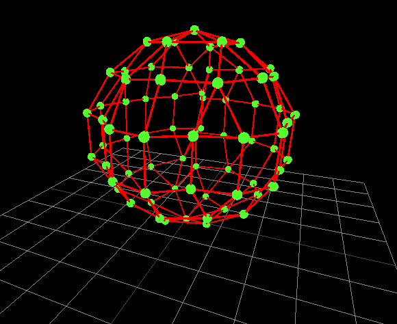
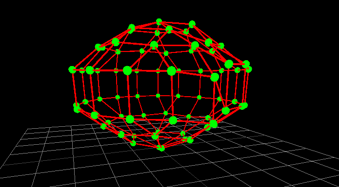
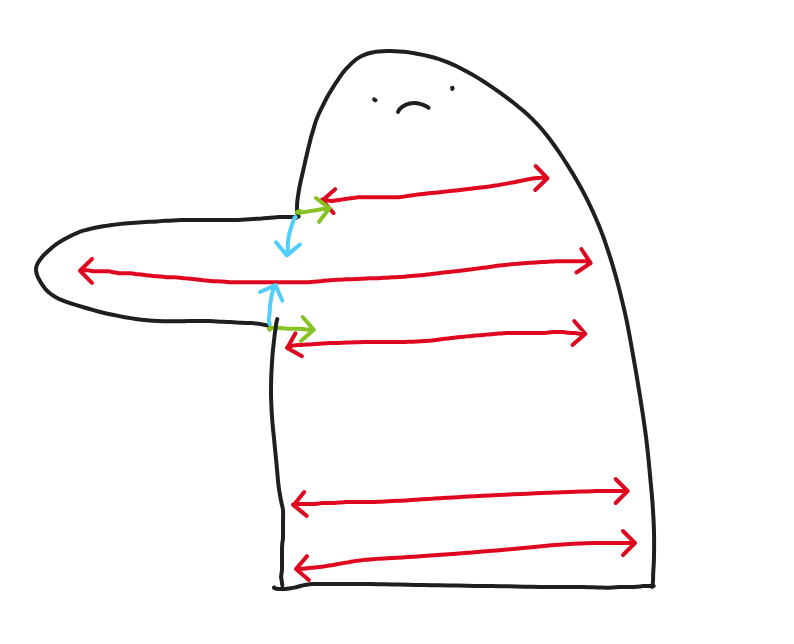

# Requirements

Code name for the visualized entity is `Plushie`.

Plushie must support
- writing to STL
- inserting / removing / changing stitches and adapting to the changes
  - `Pattern` and `Pattern -> Plushie` conversion must be defined first
- variable pressure (stuffing amount)
- fixed points (one is the bare minimum)

# Implementation

Location of vertices is calculated with a variation of a [force-directed graph](https://en.wikipedia.org/wiki/Force-directed_graph_drawing).

## Attraction / repulsion
Connections (edges) between stitches (nodes) are the most basic source of tension in a `Plushie`. Each two connected nodes will attract on each other with force along the axis going through them, with magnitude given by
$$f(x)=\frac{(x-d)^{3}}{(\frac{x}{2}+d)^{3}}\{x\ge0\}$$
where
- x: distance between nodes
- d: desired distance between nodes
- positive $f(x)$ means attraction, negative means repulsion

*attraction function for d=1*

## Stuffing
Another force acting on a plushie is the stuffing pushing it's walls out. The first attempt at implementing it in this project is called **per-round stuffing**. (Linear time).

### Failed attempt
There was an attempt to just repulse nodes from line X=0, Z=0. However if too many nodes were pulled to one quadrant of the XZ plane, the whole structure would get skewed in an absurd way

### Per-round stuffing
In this approach
- calculate the center of each round
- calculate the desired distance between points and center for each round
- push out points that are too close to the center

Center of a round is calculated as the average of positions of points.

#### Desired distance
- Let $R$ be a round with $N$ stitches, and let $d$ be the desired distance between stitches.
- With realistic stuffing and no other rounds acting on $R$, it's points should be approximating a circle of circumference $Nd$
- Therefore, we can take the radius $r=\frac{Nd}{2\pi}$ of that circle as the desired distance between points and round center, possibly scaled by a constant
- Turns out function continuity is important
  - ~~If the distance is less then desired, the node is pushed by a unit vector along the axis between center and itself~~
  - too_close = desired_radius - actual_distance
  - push = diff.normalize() * (too_close / 4.0).powi(2)

*ball generated with attraction + per-round stuffing*

*addition of gravity makes the shape more realistic, but it will eventually collapse without vertical stuffing. This may seem useful for simulations, but there is no clear point of stopping, and such is necessary for fitness functions*

*gravity + time*

### Need for vertical stuffing
Per-round stuffing works only horizontally. That might be enough if gravity is off and Y of the last point is approximated somewhat accurately in the beginning.

Gravity can be generally turned off for regular plushies, but is necessary for:
- more realistic simulations
- partially non-stuffed creations
- if a plushie has limbs, they could go to weird places

Vertical stuffing will also be required for plushies with "limbs"

- red: per-round stuffing force
- blue and green: link forces

if there is nothing counteracting the blue link force, the region where limb is connected to body may malform, and it certainly will collapse if gravity is on. With gravity it may collapse all the way to the ground, as there is no force between disconnected nodes.

Furthermore, the force in per-round stuffing may even work like this, depending on stitches used

### Vertical stuffing
Calculating center of mass, then pushing away from it would be trivial, however it would fail for certain concave shapes, as well as shapes with limbs.

What we actually need is a [skeleton](https://scikit-image.org/docs/stable/auto_examples/edges/plot_skeleton.html) that will repel walls

Problem: the plushie is a point cloud, a radically different data structure than 2D images for which skeletonization is defined

[The algorithm is also utilized in 3D](https://imagej.net/plugins/skeletonize3d)

- Skeletonization needs a volumetric representation (3D binary image)
- how do I convert a point cloud of a plushie into binary image
  - by analogy to 2D images
    - filling holes morphology
  - by dilation from XZ axis
    - requirement: the cloud is around the axis
    - problem: how to handle shapes going through the axis at some point (imagine crochetting a standing letter `C`)
      - could be handled by starting the dilation at origin
      - or before the actual dilation
        - dilute along XZ axis
          - by "dilute" I mean mark voxels as `inside` as long as there is no wall in vicinity
        - if encountered a wall, continue processing, but don't mark voxels
        - when a wall is encountered again start marking once again
        - repeat