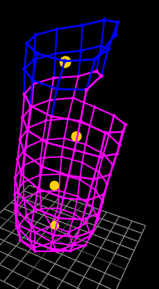
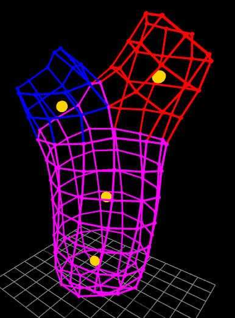

<!-- TODO keyword attach -->
<!-- TODO make sure current implementation is mentioned as Crocheteer in the introduction -->
<!-- TODO make sure centroids in visualization are explained -->

# Formal language for amigurumi patterns

To process a crochet pattern, we need to express it using a formal language.

Patterns shared in the community have equivalent overall structure, but do not follow a strict grammar. For example, repetition of stitch *Sc* 7 times could be seen written as "7 SC", "[SC] x 7", "(sc) 7 times" and more.
<!-- if this needs a source, it would have to be random patterns online
https://yarnsociety.com/patterns/celia-the-crab/
https://www.themaryjay.com/free-patterns/crochet-turtle-pattern
https://www.tinycurl.co/how-to-amigurumi-crochet/#stitches -->

This work shall define a domain specific language, *Amigurumi Crochet Language (ACL)*, that should be easily understood by creators that can read a pattern found online.

## Amigurumi Crochet Language grammar
### Starter
An amigurumi piece begins with either MR (Magic Ring) or Ch (Chain) ([1] pages 4, 18), so an ACL document also begins with one of them. MR or Ch can be constructed from an arbitrary number of stitches, so those instructions take an argument specifying that number.

```
MR(6)
```
```
Ch(18)
```

The only instructions allowed before a starter are *parameters* and yarn describing *actions* (defined in further subsections).

### Rounds
After the starter, an amigurumi piece is worked stitch by stitch in a spiral. A set of stitches going all around the perimeter of current piece is called a *round*.
A round is denoted by its number, then a colon (`:`), followed by a list of stitches (details below).
```
R1: 6 sc
```

Crochet patterns typically display how many stitches the user should have available after each round. In ACL, that part is optional, and denoted as an integer in parentheses after the stitches.
```
R1: 6 sc (6)
R2: 6 inc (12)
```

Sometimes a whole round needs to be repeated several times, which is denoted with a range of rounds.
```
R1-R2: 6sc
```

While a user is developing their pattern, it would be a nuisance to keep correcting the changing round numbers. Therefore, round numbering in ACL is optional, and round repetition can be set by just putting an integer before the colon.
```
: 6 sc
2: 6 sc
```

### Stitches
ACL currently works with 3 types of stitches:
- sc - single crochet ([[1]] page 7)
- inc - increase ([[1]] page 12)
- dec - decrease ([[1]] page 12)

Stitches are only placed inside *rounds*. Each round contains a comma-separated list of stitches. Each stitch is optionally preceded by a number stating how many times it should be repeated.
```
sc, inc, 2 sc, inc, sc
```

Sometimes parts of a round are repeatable. These parts can be described using ACL's subpatterns
```
[sc, inc] x 2, 2 sc
```
is equivalent to
```
sc, inc, sc, inc, sc, sc
```

### Actions
The person crocheting has a few actions available besides creating new stitches. With a few exceptions, *actions* are permitted either between stitches of a round or between rounds.

#### Fasten-off
When the piece is done, the last round is typically squeezed together by performing a fasten-off (FO) [[2]]. Note that fasten-off as described in [[1]] only prevents yarn unwinding, and that described in [[2]] also serves to close the piece tightly. `FO` is only allowed between rounds. No stitches may be placed after FO, unless `goto` action is used.

```
...
: 6 dec
FO
```

#### Back-loop-only, front-loop only, both-loops

<!-- [2] page 14 -->

Each existing stitch can be split into 2 loops. One on the inner side (back-loop), one on the outer side (front-loop). By default, new stitches are anchored to both of those loops. Using single loop creates a sharper corner in the piece.
Using actions `BLO` and `FLO`, the default behavior can be altered so that new stitches are anchored to just the back loop or just the front loop. Default behavior is restored at the start of next round or by using `BL`, which stands for both loops.

```
: FLO, 12 inc
: 24 sc
: 6 sc, BLO, 12 sc, BL, 6 sc
```

#### Mark and goto
Actions `mark` and `goto` are used in pairs to mark a working position, and return there later. Both of these actions require an identifier for the position.
For example, following code closes a piece by working on the back-loop, fastens-off, and then returns to continue working from the front loop.

```
...
: 6 sc
mark(point_of_split)
: BLO, 6 sc
FO

goto(point_of_split)
: FLO, 6 inc
: 12 sc
...
```

#### Yarn color
`color` action allows setting color for part of the piece in the visualization. It takes 3 integer arguments, representing the RGB components of the color.

```
color(255, 255, 0)
: 6 sc, color(0, 0, 255), 12 sc
```
#### Attach
Attach action involves creating a chain at current position, then attaching it to a previously marked spot. This effectively splits the current round into two independent ones. *Attach* takes 2 arguments: identifier of position where the chain is attached and size of the chain.

Consider the following pattern creating the shape of letter Y (as seen is figure X).
<!-- TODO figure num -->

Firstly, the stem with perimeter of 12 stitches:
```
MR(6)
: 6 inc (12)
6: 12 sc (12)
```
Then, the beginning of the round is marked as `A`. 6 out of 12 stitches are used. Another mark `B` is placed right before splitting the round. Then a chain of 3 is used to connect the current position with position A.
```
: mark(A), 6 sc, mark(B), attach(A, 3)
```

<!-- TODO diagram? fusion 360 could make it look pretty? -->

There are now two independent workable perimeters. After `attach(A, _)`, the hook is in position `A`, as if `goto` was used. Let's create one "branch" of the letter Y and color it blue. Notice that we have 9 stitches available, as we used a chain of 3 stitches, and there were 6 stitches between `mark(A)` and `anchor(A, 3)`.
```
color(0, 0, 255)
2 : 9 sc (9)
```


If we now `goto` the mark placed immediately before the `attach`, we can create the second "branch".
```
goto(B)
color(255, 0, 0)
3: 9 sc (9)
```



### Comments
Comments start with a hash `#` and continue until the end of the line. There are no multi-line comments in ACL.

```
color(255, 0, 0) # switch to red yarn
```

### Parameters
Patterns may need a specific simulation/visualization setup. ACL grammar handles that by accepting arbitrary key-value pairs using the following syntax.
```
@key = value
@centroids = 2
```

Concrete keys used by Crocheteer are described in further sections.

## Sample ACL pattern
The following pattern describes a simple mushroom shape.
```
@centroids = 2

color(160, 80, 40)

MR(6)
R1: 6 inc (12)
R2: 12 sc
R3-R4: 12 sc (12)
mark(cap_start)
R5: BLO, 6 dec (6)
FO

goto(cap_start), color(255, 255, 0)
R6: FLO, 12 inc (24)
R7-R8: 24 sc (24)
R9: [dec, sc] x 8 (18)
R10: [dec, sc] x 6 (12)
R11: 6 dec (6)
FO
```

## Parser
ACL parser returns a list of stitches and actions, and a dictionary of parameters. The type handling the parsing in Crocheteer[[3]] is `Pattern`.
ACL parser and lexer are generated using [pest](https://pest.rs). Pest generates these based on a [parsing expression grammar (PEG)](https://en.wikipedia.org/wiki/Parsing_expression_grammar) defined using a [custom syntax](https://pest.rs/book/). The following code defines ACL using that syntax.
```
program = { SOI ~ (round | comment | parameter | control | NEWLINE)+ ~ EOI}

parameter   = { "@" ~ IDENT ~ "=" ~ IDENT ~ LINEEND }

round       = { roundspec? ~ ":" ~ stitches ~ round_end? ~ LINEEND }
roundspec   = {
    round_range
  | round_index
  | NUMBER
}
round_index = @{ R ~ NUMBER }
round_range = @{ R ~ NUMBER ~ "-" ~ R ~ NUMBER }
round_end   =  { "(" ~ NUMBER ~ ")" }

stitches   = { stitch_sequence ~ ("," ~ stitch_sequence)* }
stitch_sequence  = {
      (NUMBER ~ KW_STITCH)
    | KW_STITCH
    | interstitchable_action
    | repetition }
repetition = { "[" ~ stitches ~ "]" ~ "x" ~ NUMBER }

control = { action_sequence ~ LINEEND }
action_sequence = { action ~ ("," ~ action)* }
arg_int   =  { "(" ~ NUMBER ~ ")" }
arg_int_3 = _{ "(" ~ NUMBER ~ "," ~ NUMBER ~ "," ~ NUMBER ~ ")" }
arg_ident =  { "(" ~ IDENT ~ ")" }
arg_ident_int = { "(" ~ IDENT ~ "," ~ NUMBER ~ ")" }


action = {
      interstitchable_action
    | (KW_MR ~ arg_int)
    |  KW_FO
}
interstitchable_action = {
      KW_BLO
    | KW_FLO
    | KW_BL
    | (KW_MARK ~ arg_ident)
    | (KW_GOTO ~ arg_ident)
    | (KW_COLOR ~ arg_int_3)
    | (KW_CH ~ arg_int)
    | (KW_ATTACH ~ arg_ident_int)
}

KW_MR     = { "MR" }
KW_FO     = { "FO" }
KW_MARK   = { "mark" }
KW_GOTO   = { "goto" }
KW_FLO    = { "FLO" }
KW_BLO    = { "BLO" }
KW_BL     = { "BL" }
KW_CH     = { "ch" | "Ch" }
KW_COLOR  = { "color" }
KW_ATTACH = { "attach" }
KW_STITCH =  { "sc" | "inc" | "dec" }

comment     = _{ "#" ~ not_newline* ~ (NEWLINE | EOI) }
not_newline = _{
    !(NEWLINE) ~ ANY
}

LINEEND     =  { NEWLINE | comment | EOI }
PLACEHOLDER =  { "_" }
R           =  { "R" }
ALPHA       =  { 'a'..'z' | 'A'..'Z' }
IDENT       = @{ (ALPHA | DIGIT | "_")+ }
NUMBER      = @{ (NONZERO ~ DIGIT*) | "0" }
NONZERO     = _{ '1'..'9' }
DIGIT       = _{ '0'..'9' }
WHITESPACE  = _{ " " }

```

The PEG above would be equivalent to the following BNF grammar.
<!-- TODO: BNF notation -->
```
```

[1]: https://www.montana.edu/extension/blaine/4-h/4h_documents/CrochetMadeEasy.pdf
[2]: https://crochettoplay.com/how-to-fasten-off-in-amigurumi/
[3]: https://github.com/Oloqq/crocheteer