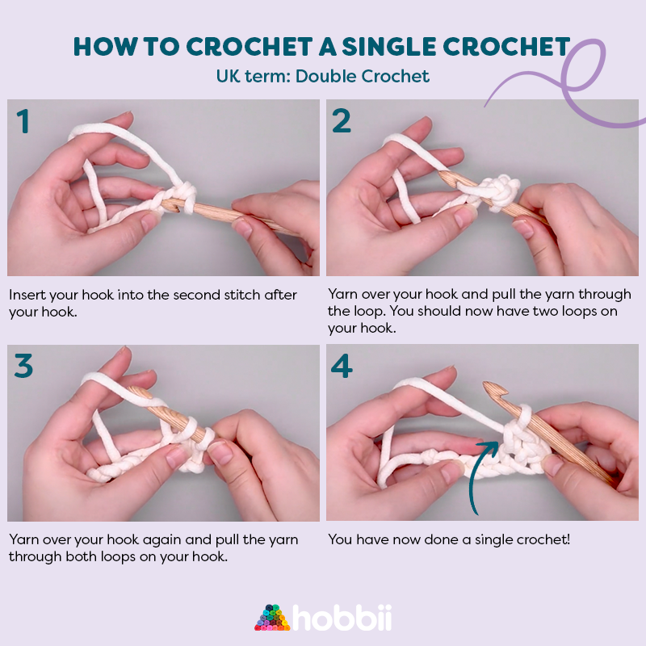

# Representing connected stitches as a graph

Once the pattern is parsed into a list of actions, those actions need to be transformed into a graph, that will later have forces applied to it. In this graph, nodes shall represent singular stitches or more precisely, spots where a human performs "pull over". That is step 3 in the figure.

https://hobbii.com/blog/single-crochet

For example, action `sc` would produce one node in the graph, `dec` would produce one node as well, and `inc` would produce two nodes.

Edges in the graph represent the fabric connecting those stitches. Each stitch is connected to the previously created stitch (unless `goto` has been used). Each stitch <!-- excluding chains, gotta see if chains make it to final version --> is also connected to one (for `sc` and `inc`) or more (`dec`) stitches from the last round. Stitches from the first round in this case are connected to a virtual stitch representing the center of the magic ring (`MR`).
