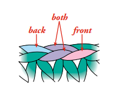
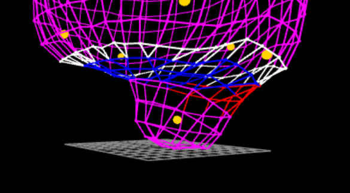
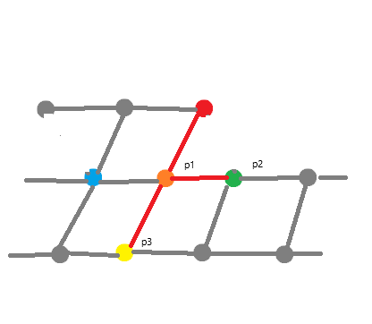

<!-- TODO make sure current implementation is mentioned as Crocheteer in the introduction -->
<!-- TODO proper latex algorithms -->

# Representing connected stitches as a graph

## Overview
Once the pattern is parsed into a list of actions, those actions need to be transformed into a graph, that will later have forces applied to it. In this graph, nodes shall represent singular stitches or more precisely, spots where a human performs "pull over" (as shown in figure X and [[1]] page 7, under "Single Crochet", step 2).
<!-- TODO figure num -->


For example, action `sc` would produce one node in the graph, `dec` would produce one node as well, and `inc` would produce two nodes.

Edges in the graph represent the fabric connecting those stitches. A typical stitch is connected to the previously created stitch, and to one or more stitches from the last round. Details and exceptions are described throughout this section.

The procedure takes a list of stitches and actions produced by ACL parser and outputs a tuple describing nodes and edges of the graph:
$$(E, C, P)$$
Where
<!-- TODO need help with math notation -->
$$
I: \text{valid node indexes}
\\
E: I \rightarrow \{ j: \text{nodes } i \text{ and } j \text{ are connected } \land i > j \}; i,j \in I
\\
C: I \rightarrow [0, 255]^3
\\
P: I \rightarrow \{ \text{null, root, tip, FLO, BLO} \}
$$

- $E$ represents the edges of the graph. Note that the condition $i > j$ is introduced to ensure the representation is unamiguous.
- $C$ represents the color of each node. Crocheteer works with 8 bit RGB values.
- $P$ is a dictionary storing peculiarities of graph nodes. The significance of $P$ will be exlained in section 5 describing the forces acting on the graph. These peculiarites include nodes that are
  - a virtual node at the start of a piece (root)
  - virtual nodes created by an FO (tip)
  - attached to only the front loop or the back loop (FLO/BLO)

## Graph construction
In Crocheteer[[3]], graph construction is handled by struct `Hook`, and the output tuple is defined as `HookResult`.

`Hook` iterates over the list of stitches and actions produced by ACL parser and tries to apply each of them, while looking for semantic errors. These include misplacing a MR, duplicating a `mark`, `goto` to an undefined `mark`, and others.

As `Hook` constructs the graph, it assigns an incrementing index to each stitch.
For each stitch, `Hook` creates a new entry in $E$. That entry is a set of node indexes that the new stitch is connected to.

### State management
`Hook` stores two kinds of internal state. First one is related to the whole creation; call it global state. The second kind of state describes the currently worked round; call it `Moment`. This separation is crucial to implement `mark`, `goto`, and `attach`, that is actions that allow user to alter the standard order of creating stitches. The global state stores a mapping from `mark` labels to `Moment`.

#### Moments
`Moment` is defined as the following structure:
```rs
struct Moment {
    cursor: usize,
    anchors: Queue<usize>,
    round_count: usize,
    round_left: usize,
    working_on: WorkingLoops,
}

enum WorkingLoops {
    Both,
    Back,
    Front,
}
```
- `cursor` is the next node index to be used.
- `anchors` is a queue storing indexes of stitches from the previous round.
- `round_count` and `round_left` store number of stitches produced for the current round and number of stitches still available from the previous round. See `round_spans` in global state.
- `working_on` keeps track of FLO/BLO.

<!-- NOTE there is no error checking on mistake in FLO BLO and gotos -->

#### Global state
The global state is stored directly in `Hook` instance.
```rs
struct Hook {
    edges: Edges,
    peculiar: HashMap<usize, Peculiarity>,
    now: Moment,
    /// Contains first and last stitch of each round. Treated as a range, both extremes are inclusive.
    round_spans: Vec<(usize, usize)>,
    /// Storage of index -> it's anchor, used for single loop forces
    parents: Vec<Option<usize>>,
    /// Storage of spots for Mark and Goto
    labels: HashMap<Label, Moment>,
    /// Current color/yarn. Not stored in Moment as typically yarn changes happpen independently of switching positions.
    color: colors::Color,
    /// Storage of index -> it's color
    colors: Vec<colors::Color>,
    // Previous stitch might need to be overwritten after a Goto
    override_previous_stitch: Option<usize>,
    /// Was the last action a mark?
    last_mark: Option<Action>,
}

struct Edges {
    edges: Vec<Vec<usize>>,
}

type Label = usize;

enum Peculiarity {
    Root,
    Tip,
    BLO(PointsOnPushPlane),
    FLO(PointsOnPushPlane),
}

type PointsOnPushPlane = (usize, usize, usize);
```

- `edges` directly corresponds to $E$ from the procedure output. Type `Edges` is introduced, instead of directly using `Vec<Vec<usize>>`, so the type can implement error checking and enforce the condition $i > j$ of $E$.
- `peculiar` directly corresponds to $P$ from the procedure output. Variant `Root` denotes the virtual node at the basis of `MR`. `Tip` denotes the virtual node created by an `FO`. Variants `BLO` and `FLO` of `Peculiarity` are described in section 4.X<!-- TODO Handling front-loop-only and back-loop-only -->
- `now` stores the current `Moment`
- `round_spans` is used to keep track of where rounds begin and end. This is mostly for setting initial positions of nodes described in section 5, but may also be used to verify the round counts annotated in ACL.
- `parents`. A parent of node $n$ is a node that $n$ is anchored to. Note that even though a node created by `dec` is anchored to two nodes we only need to store one of them. Usage of `parents` is described in section 4.X.<!-- TODO Handling front-loop-only and back-loop-only -->
- `labels`. When `Hook` encounters ACL's `mark`, field `now` is cloned and saved in `labels`. This HashMap is used with `goto` and `attach`.
- `color` keeps track of the currently used yarn.
- `colors` directly corresponds to $C$. It is tempting to only store changes in color, but with the current approach it is easier to use colors for debugging.
- `override_previous_stitch`. Stitches are linked to the previously created stitch. Its index is usually acquired by `now.cursor - 1`, but after a `goto` previous stitch needs to be overwritten.
- `last_mark`. A mark is stored for one iteration, as if the next action is `attach`, that mark needs to be altered (see section 4.X <!-- TODO Handling attach -->).

### Handling basic stitches
Following definitions and abbreviations are used in this section:
```
hook: instance of structure Hook
A = hook.now.anchors
E = hook.edges
c = hook.now.cursor
p: last removed anchor that may become a parent

function previous_stitch()
    if hook.override_previous_stitch = nil then
        return c - 1
    else
        x <- hook.override_previous_stitch
        hook.override_previous_stitch <- nil
        return x
    end if
end function
```

Every time an anchor is removed from $A$, `anchor_removed` is run to keep track of rounds:
```
function anchor_removed(a)
    p <- a
    hook.now.round_left -= 1
    if hook.now.round_left = 0 then
        new_span <- (hook.now.cursor - hook.now.round_count, hook.now.cursor - 1)
        hook.round_spans.append(new_span)
        hook.now.round_left <- hook.now.round_count
        hook.now.round_count <- 0
    end if
end function
```

Every time `hook.now.cursor` is about to advance, the following procedure is run to register node's parents and color.
```
function cursor_advance()
    hook.parents[c] <- p
    hook.colors[c] <- hook.color
end function
```

#### Single crochet
```
if |A| = 0 then
    return Error("No anchors")
end

a <- A[0]
E[c] <- E[c] || {a, previous_stitch()}
A <- A[1:] || {c}
anchor_removed(a)
cursor_advance()
c <- c + 1
```

#### Increase
```
if |A| = 0 then
    return Error("No anchors")
end

a <- A[0]
E[c] <- E[c] || {a, previous_stitch()}
cursor_advance()
c <- c + 1
E[c] <- E[c] || {a, previous_stitch()}
A <- A[1:] || {c}
anchor_removed(a)
cursor_advance()
c <- c + 1
```

#### Decrease
```
if |A| < 2 then
    return Error("No anchors")
end

a0 = A[0]
a1 = A[1]
E[c] <- E[c] || {a0, a1} || E[previous_stitch()]
A <- A[2:] || {c}
on_anchor_removed(a0)
on_anchor_removed(a1)
cursor_advance()
c <- c + 1
```
---
You may notice some repeated parts in the algorithms above. The repeatable parts are associated with certain movements the crocheting person makes when creating the stitches. Crocheteer takes advantage of that by using a builder pattern with struct `Stitch`. Methods of `Stitch` correspond to atomic actions like pulling the yarn through a stitch from the previous round (`pull_through`) or tying together all loops currently on the hook (`pull_over`). Put together, they implement the algorithms described above. With this approach, we hope it will be easy to extend the capabilities of Crocheteer to handle more complex stitches.
```rs
// (self is a Hook instance)
match action {
    Sc => {
        self = Stitch::linger(self)?
            .pull_through()?
            .pull_over()?
            .finish()?
    }
    Inc => {
        self = Stitch::linger(self)?
            .pull_through()?
            .pull_over()?
            .pull_through()?
            .pull_over()?
            .finish()?;
    }
    Dec => {
        self = Stitch::linger(self)?
            .pull_through()?
            .next_anchor()?
            .pull_through()?
            .pull_over()?
            .finish()?;
    }
    ...
}
```

### Handling front-loop-only and back-loop-only
Each stitch contains two loops that subsequent stitches can anchor to.

The back loop is the one on the inside of an amigurumi piece, the front loop is on the outside. A stitch that is anchored to both loops has a tendency to position itself right above it's parent (as per `hook.parents`). A stitch that is anchored to just the back or front loop has a tendency to position itself towards the the side of that single loop.

To implement that behavior for node $n$ in a simulation, we need to find a vector approximating the normal to the local surface around $p$. You can read more about the simulation in section 5.

For small Plushies, the obvious solution is to push nodes towards or away from the center of the plushie. This approach breaks as the plushie gets taller, because the vector between a node at the top or bottom and the center is no longer related to the normal of the local surface. For tall Plushies, a tempting solution is to calculate the center of nodes in the current round, and push from that. This approximation starts to fail when the Plushie has no axial symmetry, as illustrated on figure X


TODO: draw arrows representing the stuffing force

Another solution would be to calculate surface normals as CloudCompare [[4]] does. In Crocheteer we found that we can also derive a good-enough (and trivial to compute) approximation by fitting a plane through 3 connected nodes. For that purpose, when creating a node $n$ anchored to a single loop, `Hook` saves the indexes of 3 nodes laying on the relevant plane as in algorithm X and figure X.

```
n: node anchored on a single loop
hook: Hook instance

function parent(x)
    if hook.parents[x] = nil then
        Error
    end if
    return hook.parents[x]
end function

p1 <- parent(n)
p2 <- p1 + 1
p3 <- parent(p1)

if hook.now.working_on = Back then
    hook.peculiar[n] = BLO(p1, p2, p3)
else if hook.now.working_on = Front then
    hook.peculiar[n] = FLO(p1, p2, p3)
end if
```


TODO tablet graficzny i ladny diagram.

When red node is anchored on a single loop, it will be pushed along the normal of the plane defined by positions of p1, p2, and p3. Notice there is a corner case such that the use of `goto` or `attach` could cause the green node to have an index different than $p_1 + 1$. That corner case is currently not handled in Crocheteer.


### Handling marks and gotos


### Handling attach

[1]: https://www.montana.edu/extension/blaine/4-h/4h_documents/CrochetMadeEasy.pdf
[3]: https://github.com/Oloqq/crocheteer
[4]: https://cloudcompare.org/doc/wiki/index.php?title=Normals%5CCompute