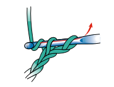
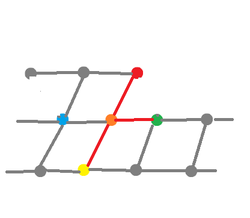

# 1. Introduction
Crocheting is a manual craft that involves weaving a yarn stitch by stitch to create a piece of fabric. The craft is commonly confused with knitting, although the techniques are vastly different.

https://www.thesprucecrafts.com/differences-between-knitting-and-crochet-4077447

Crocheting makes it easy to create 3-dimensional shapes, and the pieces are generally sturdier than knitted ones, making the technique well suited for things that should keep their shape such as decorations or toys.

> crochet as a tool to visualize hyperbolic geometry
> https://www.cabinetmagazine.org/issues/16/wertheim_henderson_taimina.php

This project focuses on using crocheting to create 3-dimentional, stuffed shapes, an art called [amigurumi](https://en.wikipedia.org/wiki/Amigurumi).

The person crocheting, works by following a *pattern* that describes the sequence of stitches necessary to achieve a certain shape. Designing such a pattern is trivial for axially symmetrical shapes, but otherwise requires much trial and error.

>dino's body+tail is an example of non-symmetrical shape\
>ai generated, but proves the point\
>sites providing patterns use ai images to lure artists by using more attractive shapes, that they don't have patterns for \
>
> https://theamigurumi.com/wp-content/uploads/2024/01/Crochet-Dinosaur-Trex-Amigurumi.jpg
>

There are currently no tools that could help with designing such shapes. The closest thing is [Crochet Lathe](https://avtanski.net/projects/crochet/lathe/), however the tool is only applicable to simple, axially symmetrical shapes.

## 1.1 Objectives

The goal of this project is to create a tool, that would let an artist visualize the plushie that their pattern produces before commiting hours into actually crocheting it.

## 1.2 Structure
TODO

# 2. Crocheting
This section aims to give just enough information to understand the algorithms described in further sections. A curious reader may find more details about the process in dedicated guides. [guide1](https://www.tinycurl.co/how-to-amigurumi-crochet/#stitches).

> working starts from a circle (MR/Ch)\
> worked in rounds\
> define basic stitches (sc, inc, dec)\
> sharper corner are made with back loop only, front loop only (BLO, FLO)\
> explain fasten off (FO)\
> hook can be reinserted into a plushie (grzib is a good example)\
> branches are created with chains and gotos\

# Theory
## Overview

## Pattern as a formal language
[subdocument](./Formal%20language%20for%20amigurumi%20patterns.md)

## Representing connected stitches as a graph

## Making the graph spatial

## Relaxing the graph
### Stich-to-stitch force

### Centroid stuffing

### Skeleton-based stuffing

# Implementation
## Backend
### Pest-parser
> ACL -> list of stitches
### Hook
> list of stitches -> non-spatial graph of connected stitches
### Simulation
> graph -> spatial graph of stitches
### Stuffing
> relaxing the graph

## Frontend
> websockets, threejs, dat.gui
> simulation controls

# Results

# Goal summary